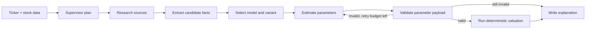

# AutoGraham

AutoGraham is a Streamlit equity-research app that combines **deterministic valuation models** with an **AI-agent workflow**.

The project is built around a simple idea: let the agent do what agents are good at, and let code do what code is good at.

- The agent researches the company, extracts usable facts, chooses the valuation family, estimates structured assumptions, and explains the result.
- The Python valuation engine remains deterministic, testable, and auditable.
- The UI makes that workflow usable through three pages: **Market View**, **Valuation Lab**, and **AI Analyst**.

## Why This Is More Than "An LLM App"

This repo is intentionally designed like an **agent system**, not a single prompt wrapped in a UI.

1. **Goal-directed workflow**
   The AI Analyst is given a concrete task: go from ticker symbol to a defensible valuation result.

2. **Specialized subagents**
   The workflow separates responsibilities across research, fact extraction, model selection, parameter estimation, and explanation.

3. **Tool use**
   The agent can pull company context from market data, SEC filing hints, and web search rather than relying on model memory alone.

4. **Structured outputs**
   Each stage returns typed data through Pydantic schemas instead of loose prose whenever the output needs to cross a system boundary.

5. **Validation and retry loop**
   Parameter generation is not trusted blindly. The payload is validated at the model boundary and the workflow can retry estimation when inputs are not usable.

6. **Deterministic execution boundary**
   The final valuation is always computed by Python functions in `valuation/`, not by the LLM.

7. **Graceful degradation**
   If the LLM, LangChain agent, or optional graph runtime is unavailable, the app falls back to heuristic and deterministic behavior instead of failing hard.

That separation of concerns is the main design statement of the project.

## Product Surface

### 1. Market View
- Pulls live market and company data.
- Gives a fast visual read on a business before deeper analysis.

### 2. Valuation Lab
- Lets the user run DCF, DDM, and RIM models manually.
- Keeps the math transparent and assumption-driven.

### 3. AI Analyst
- Runs the end-to-end agent workflow.
- Produces a research memo, model recommendation, parameter payload, valuation result, and explanation.

## AI Analyst Workflow



In code, that orchestration lives in `agent/supervisor.py` and `agent/graph.py`.

## Architecture

### App layer
- `app.py`: Streamlit navigation entrypoint
- `pages/1_Market_View.py`: market-data page
- `pages/2_Valuation_Lab.py`: manual valuation workspace
- `pages/3_AI_Analyst.py`: agent-driven analysis page

### Agent layer
- `agent/supervisor.py`: workflow controller
- `agent/subagents/researcher.py`: broad company research with tools
- `agent/subagents/extractor.py`: converts messy text into source-aware candidate facts
- `agent/subagents/model_selector.py`: chooses between DCF, DDM, and RIM
- `agent/subagents/parameter_estimator.py`: builds a model-ready parameter payload
- `agent/subagents/explainer.py`: turns workflow artifacts into a user-facing memo

### Trust boundary
- `agent/schemas/common.py`: typed contracts for facts, model recommendations, and parameter payloads
- `agent/tools/validation_tools.py`: boundary validation, JSON extraction, and model-input normalization
- `agent/tools/calculator_tools.py`: hands validated payloads to deterministic valuation code

### Deterministic valuation engine
- `valuation/registry.py`: supported model registry and dispatch
- `valuation/dcf.py`: FCFF and FCFE DCF implementations
- `valuation/ddm.py`: DDM variants
- `valuation/rim.py`: residual income model

### Data and research tools
- `data/market_data.py`: Yahoo Finance ingestion
- `agent/tools/finance_tools.py`: finance-specific agent tools
- `agent/tools/sec_tools.py`: SEC filing hints
- `agent/tools/web_search.py`: market-context web search

## Tech Stack

- **Frontend:** Streamlit
- **LLM layer:** OpenAI via `langchain-openai`
- **Agent orchestration:** LangChain tools and an optional LangGraph runtime
- **Validation:** Pydantic
- **Market data:** `yfinance`
- **Search:** `ddgs`
- **Testing:** Python `unittest`

## How The Agent Earns Trust

If you want to talk about this project in an interview or portfolio, these are the important engineering choices:

- **The LLM never directly returns the final fair value.**
  It proposes structured reasoning inputs; Python computes the valuation.

- **The workflow is stateful.**
  The system carries forward research notes, candidate facts, selected model, parameter payload, validation status, errors, and explanation artifacts in a dedicated run state object.

- **The system is typed at the edges.**
  Free-form model output gets converted into `CandidateFact`, `ModelRecommendation`, and `ParameterPayload` objects before it can influence deterministic code.

- **There is a real control loop.**
  Invalid payloads are not silently accepted; they trigger validation errors and possible re-estimation.

- **The agent can operate with partial capability.**
  Missing credentials or missing optional packages do not make the product unusable.

This is the core "AI agent" story of AutoGraham: **research with flexibility, execution with guardrails**.

## Running Locally

### 1. Install dependencies

```powershell
python -m venv .venv
.venv\Scripts\Activate.ps1
pip install -r requirements.txt
```

### 2. Set environment variables

Create a local `.env` with:

```env
OPENAI_API_KEY=your_openai_api_key
AUTOGRAHAM_AGENT_MODEL=gpt-5.2
```

Notes:
- `OPENAI_API_KEY` enables the LLM-backed subagents.
- `AUTOGRAHAM_AGENT_MODEL` is optional. If unset, the code falls back to its default model name.
- If the LLM layer is unavailable, the app still runs with deterministic and heuristic fallbacks.

### 3. Launch the app

```powershell
streamlit run app.py
```

## Optional LangGraph Runtime

The repo includes a LangGraph-style workflow wrapper in `agent/graph.py`.

- If `langgraph` is installed, the workflow is compiled as a graph.
- If not, the project uses a sequential fallback runner with the same business logic.

That keeps the architecture graph-friendly without making the app brittle during local development.

## Tests

```powershell
python -m unittest discover -s tests -p "test_*.py"
```

Useful coverage includes:
- AI workflow orchestration
- prompt and schema handling
- parameter validation
- valuation math
- web-search normalization

## Repo Structure

```text
AutoGraham/
|-- app.py
|-- pages/
|-- agent/
|   |-- graph.py
|   |-- supervisor.py
|   |-- state.py
|   |-- subagents/
|   |-- tools/
|   `-- schemas/
|-- valuation/
|-- workflows/
|-- data/
|-- ui_components/
`-- tests/
```

## Example Thesis For The Project

AutoGraham demonstrates a practical pattern for building trustworthy AI agents in finance:

> Use the model for messy knowledge work, use schemas for control, and use deterministic code for the decision boundary.

That pattern is portable well beyond valuation. It is the same design logic you would use for underwriting, due diligence, FP&A copilots, compliance review, or internal research systems.
