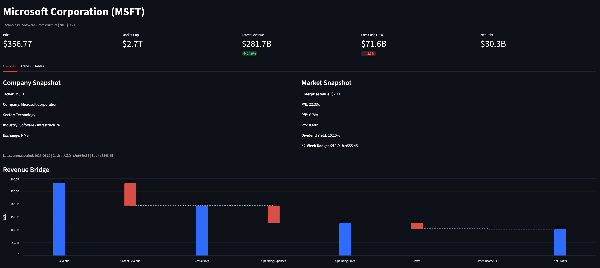
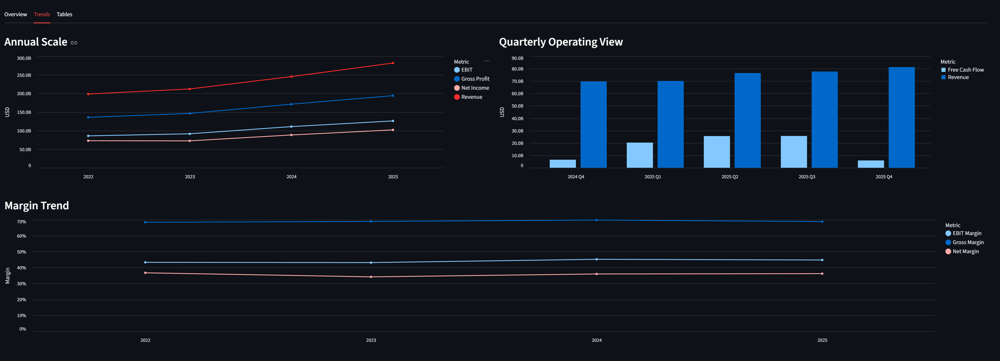
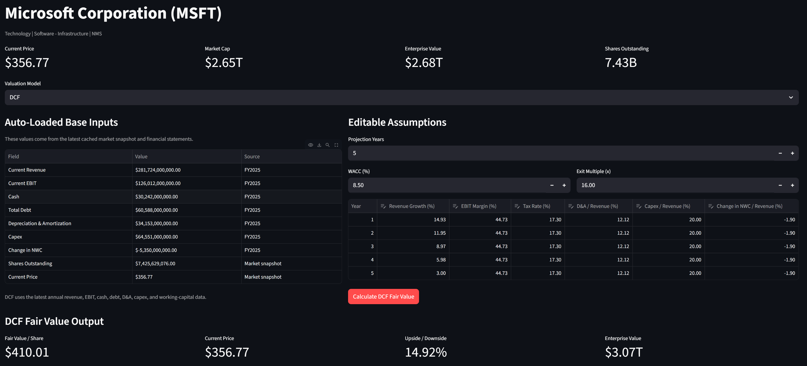
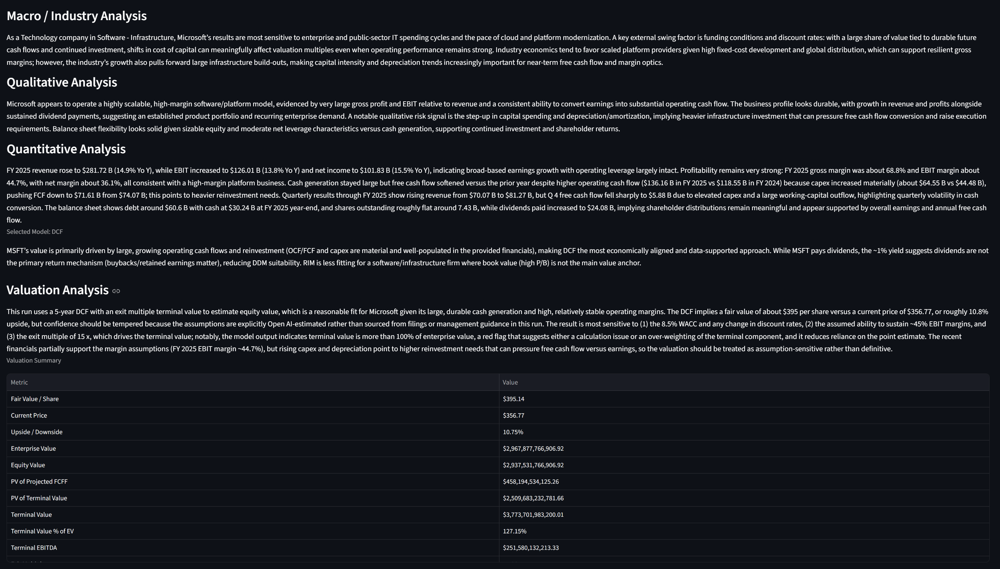

# AutoGraham

Streamlit app for exploring market data, running valuation models, and generating AI-assisted equity analysis for a public-company ticker.

The analysis workflow uses a multi-agent system: specialized agents collaborate to build context, select valuation methods, estimate assumptions, run model logic, and assemble the final report.

## What It Includes

- `Financial Data`: loads company profile, market snapshot, price history, annual financials, and quarterly financials.
- `Calculators`: runs DCF, DDM, and RIM valuations with auto-loaded defaults and editable assumptions.
- `AI Analysis`: generates macro, qualitative, quantitative, and valuation commentary using a multi-agent analysis pipeline backed by local market data and OpenAI models.

## Screenshots

| Financial Data Overview | Financial Data Trends |
| --- | --- |
|  |  |

| Fair Value Calculators | AI Analysis |
| --- | --- |
|  |  |

## Project Structure

```text
app.py
agent/
  service.py
  schemas.py
  tools.py
  skills/
data/
  market/
  transcripts/
  cache/
pages/
  financial_data.py
  calculators.py
  ai_analysis.py
valuation/
  dcf/
  ddm/
  rim/
examples/
```

## Requirements

- Python 3.13 recommended
- A virtual environment
- An OpenAI API key for the AI analysis page

## Setup

1. Create and activate a virtual environment.
2. Install dependencies:

```powershell
pip install -r requirements.txt
```

3. Add a project `.env` file in the repo root.

Example:

```env
OPENAI_API_KEY=your_api_key_here
OPENAI_MODEL=gpt-5.4
AGENT_BACKEND=deepagents
```

Notes:

- `OPENAI_API_KEY` is required for the AI analysis workflow.
- `OPENAI_MODEL` defaults to `gpt-5.4` if omitted.
- `AGENT_BACKEND=deepagents` uses the preferred deep-agent workflow when supported.
- `AGENT_BACKEND=legacy` forces the fallback single-shot workflow.

## Running The App

```powershell
streamlit run app.py
```

The app opens three pages through Streamlit navigation:

- `Financial Data`
- `Calculators`
- `AI Analysis`

## Data Sources And Caching

Market and financial data are fetched through `yfinance` and cached locally under:

```text
data/cache/market/<TICKER>/
```

Typical cached files include:

- `info.json`
- `snapshot.json`
- `price_history_5y_1d.json`
- `annual_financials.json`
- `quarterly_financials.json`

The UI includes a `Refresh cache` option to pull fresh data and overwrite cached files.

## Valuation Models

The app supports three valuation approaches:

- `DCF`: discounted cash flow using revenue growth, margin, reinvestment, WACC, and exit multiple assumptions.
- `DDM`: dividend discount model for dividend-paying businesses.
- `RIM`: residual income model for businesses where book value and ROE are useful anchors.

Each calculator page:

- loads available market inputs automatically,
- derives default assumptions from recent company data,
- lets you edit assumptions before running the model,
- returns fair value, upside/downside, and detailed projection tables.

## AI Analysis Workflow

The AI analysis page uses `agent/service.py` to:

- load local company and market context,
- coordinate a multi-agent workflow instead of relying on a single monolithic prompt,
- generate macro, qualitative, and quantitative analysis,
- choose the most appropriate valuation model,
- estimate model assumptions,
- run the selected valuation,
- return a structured report with notes and valuation tables.

In the preferred path, specialized agents handle different stages of the job, including context building, valuation selection and assumption generation, and final report writing. Some of these steps can run in parallel to speed up analysis while keeping outputs structured.

When `deepagents`, `langchain-openai`, and related dependencies are available, the app uses this multi-agent deep-agent path. Otherwise it can fall back to the legacy workflow.

## Current Repo Notes

- Local environment files such as `.env`, `.idea`, and virtualenv folders are not part of the source mirror.
- Screenshots and example images live in `examples/`.
